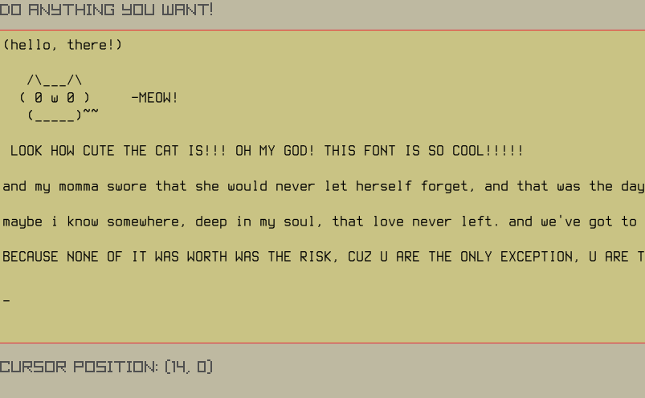

just as the name says, this repo is an attempt to recreate the cool `object inspection` and `live programming` stuff of a Lisp Listener using raylib in c/c++. 

the editor works now, u can type, scroll up/down, left/right using the arrow keys.

here's a screenshot:

